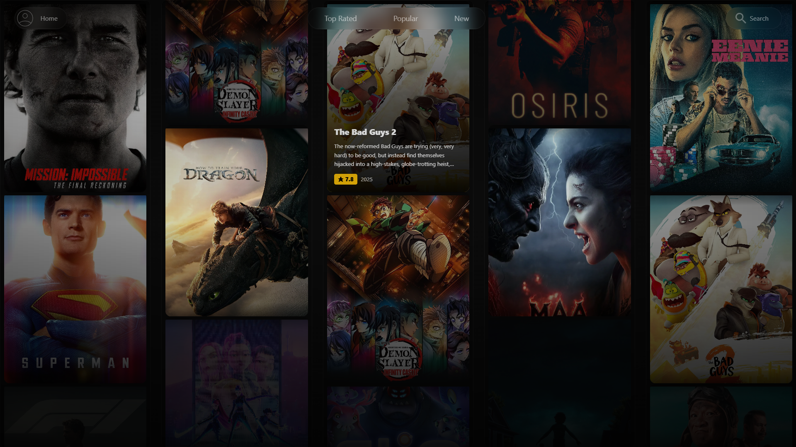
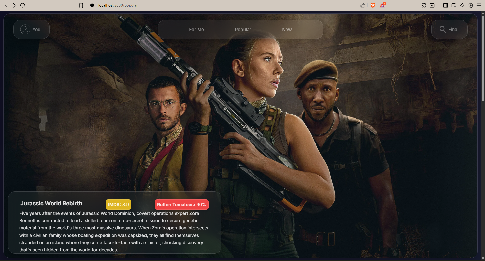
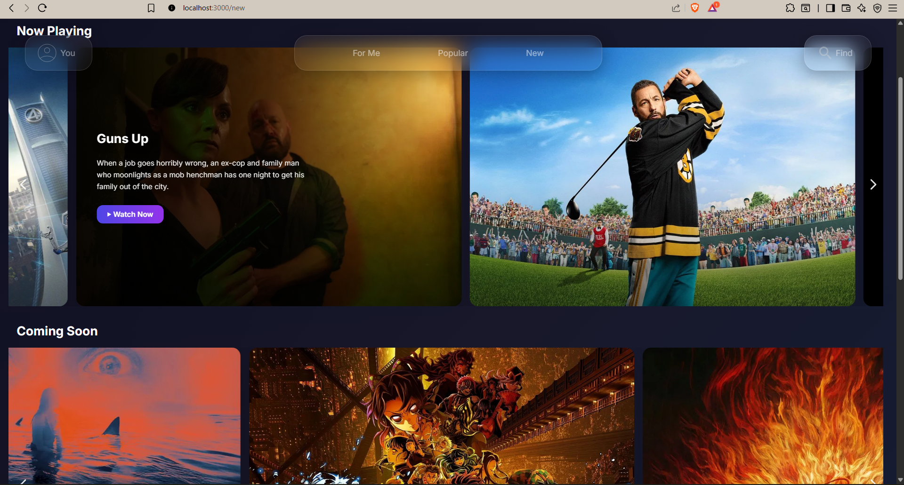
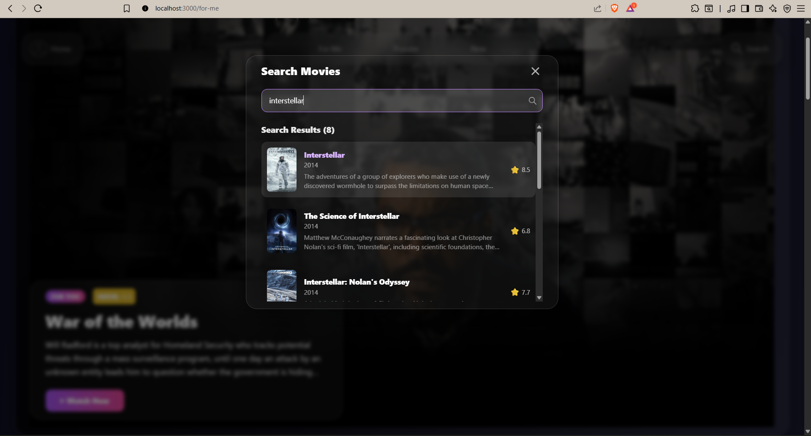
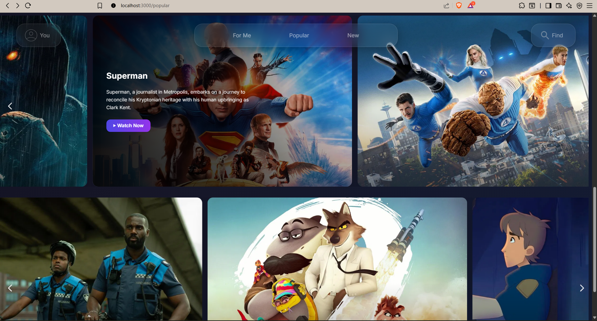

# Modern Movie Discovery (and streaming) Platform



*A Netflix-inspired movie streaming platform built by yours truly with Next.js, TypeScript, and TMDB API*

---

## Screenshots

<table>
<tr>
<td width="50%">



</td>
<td width="50%">


</td>
</tr>
<tr>
<td width="50%">

**Movie Details**


</td>
<td width="50%">

**Mobile View**


</td>
</tr>
<tr>
<td width="50%">

**For You Page**


</td>
<td width="50%">
</td>
</tr>
</table>

---

## Features

### Movie Discovery
- TMDB API integration for real-time data
- Multiple categories: Popular, New, Top Rated, For You
- Global search with keyboard shortcuts (Ctrl+K)
- Recent search history

### Dynamic Pages
- Comprehensive movie detail pages
- Cast and crew information with photos
- Similar movie recommendations
- Grid and carousel layouts

### Performance
- Next.js 14 with App Router
- TypeScript for type safety
- Optimized images and lazy loading
- Fast client-side navigation

---

## Tech Stack

- **Framework**: Next.js 14.2.11
- **Language**: TypeScript
- **Styling**: Tailwind CSS
- **API**: TMDB v3
- **Components**: Embla Carousel

---

## Quick Start

### Prerequisites
- Node.js 18+
- TMDB API Key ([Get it here](https://www.themoviedb.org/settings/api))

### Installation

1. Clone the repository
   ```bash
   git clone https://github.com/AccioMo/movies-web-application.git
   cd flix
   ```

2. Install dependencies
   ```bash
   npm install
   ```

3. Create environment file
   ```bash
   NEXT_TMDB_API_KEY=YOUR-TMDB-API-KEY
   NEXT_TMDB_ACCESS_TOKEN=YOUR-TMDB-ACCESS-TOKEN
   ```

4. Run development server
   ```bash
   npm run dev
   ```

5. Open http://localhost:3000

---

## Pages

| Page | Description |
|------|-------------|
| Home | Featured movies and trending content |
| Popular | Most popular movies with grid layout |
| New | Latest releases and upcoming movies |
| For Me | Personalized recommendations |
| Movie Details | Full movie information and cast |
| Search | Global search with real-time results |

---

## License

MIT License - see [LICENSE](LICENSE) file for details.

---
